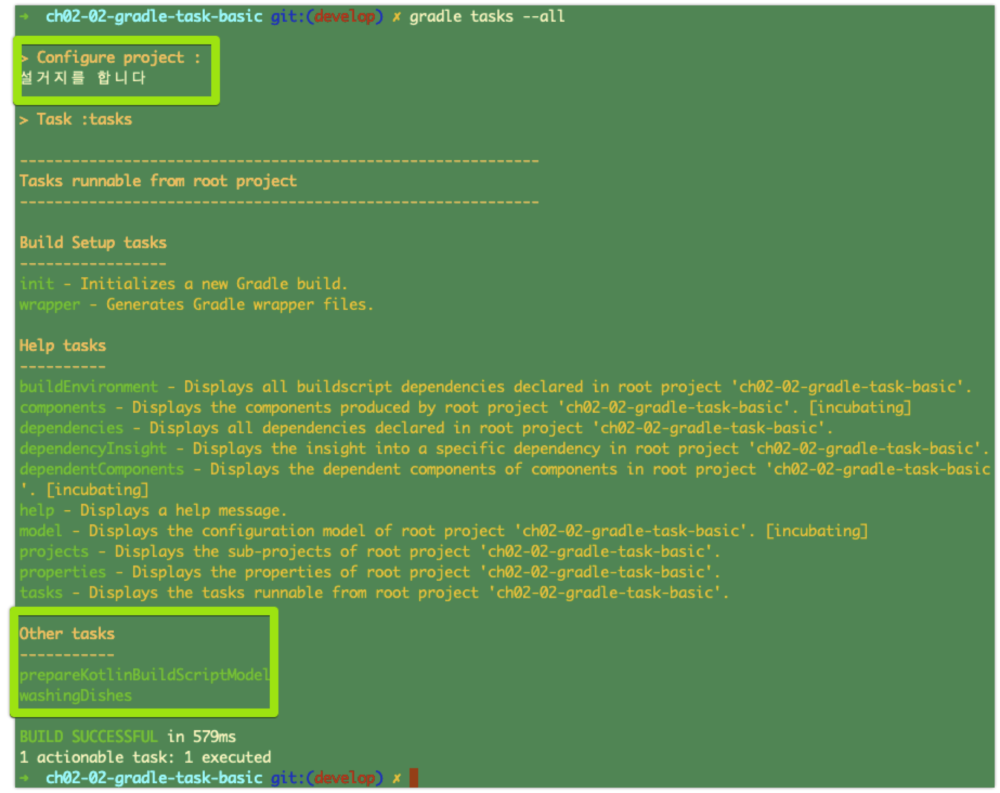
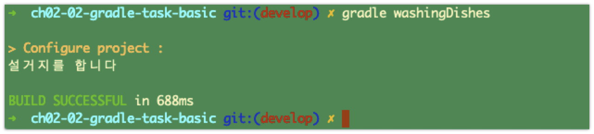

# Task 생성해보기

ch02-01-Gradle-기본 에서는 그레이들이 뭐구나~ 할 만한 내용들을 정리해봤다. 이제는 Task를 생성해서 빌드로 돌려보는 것을 정리해보려 한다. 


# 0. Gradle 프로젝트 생성

이번 문서에서 사용할 Gradle 프로젝트를 생성해보자. 처음 해보는 거라 손이 잘 띄어지지 않겠지만... 마음 고쳐먹고 한번 할때 긴장타고 얼렁얼렁 타이핑을 해봐야 빨리 배운다.

```bash
➜ gradle init

Select type of project to generate:
  1: basic
  2: application
  3: library
  4: Gradle plugin
Enter selection (default: basic) [1..4] 1

Select build script DSL:
  1: Groovy
  2: Kotlin
Enter selection (default: Groovy) [1..2] 1

Project name (default: ch02-02-gradle-task-basic):

> Task :init
Get more help with your project: https://guides.gradle.org/creating-new-gradle-builds

BUILD SUCCESSFUL in 11s
2 actionable tasks: 2 executed
```


# 1. Task 만들어보기

직접 테스크를 만들어보자. 만들어보려는 Task의 이름은 washingDishes 라고 하자. 설거지라는 이름으로 정했는데, 기억하기 쉬울것 같아서 washingDishes 라는 이름으로 했다.  

역시 처음 해보는 것은 손이 잘 안 간다. 얼렁얼렁 타이핑쳐보자. 위에서 생성한 프로젝트 디렉터리 안에 들어가서 build.gradle 파일을 열어서 아래와 같이 입력해주자.  


## build.gradle :: 태스크 정의하기

아래와 같이 task 를 정의해주자. task 키워드와 함께 태스크명 괄호를 주어서  `task 태스크명 {...}` 와 같은 형태로 태스크를 정의할 수 있다. 마치 함수를 정의하는 것과 유사해보인다.

> task 태스크명 {
>
> ​	// 실행할 작업들 선언
>
> }

  

**ex) build.gradle**

```groovy
/*
 * This file was generated by the Gradle 'init' task.
 *
 * This is a general purpose Gradle build.
 * Learn how to create Gradle builds at https://guides.gradle.org/creating-new-gradle-builds
 */

task washingDishes {
    println '설거지를 합니다'
}
```


## gradle tasks :: 태스크 목록 확인

> 등록되어 있는 task들의 목록을 알고 싶을 때 `gradle tasks` 명령을 통해 확인 가능하다.  

  

```bash
➜ gradle tasks --all
```


**출력결과**  




# 2. Task 실행해보기

## gradle [태스크명]

태스크의 실행은 `gradle [태스크 명]` 을 수행해서 태스크를 실행할 수 있다.

> $ gradle [태스크 명]


```bash
$ gradle washingDishes
```

  

**출력결과**   




# 3. Task 실행 순서 제어해보기


# 4. 디폴트 Task 지정하기


# 5. Task 에 설명 추가하기


# 6. 다른 Task에 dependsOn 을 걸어서 실행하기


# 7. 로깅


# 8. Task 그루핑

